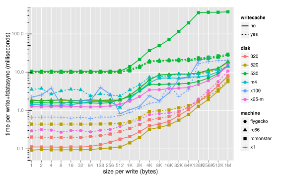

This is a set of benchmarking utilities for measuring the latencies of disks
(mostly interesting for SSDs).

The lowest level tool is the `bench` program. This is a microbenchmark that
executes repeated writes and fsyncs of the requested size. To build it and see
its usage, run:

    make bench
    ./bench --help

A possibly outdated version of that message is:

    Time how long it takes to append into a file and fdatasync it.
    The results are printed in seconds total for all the writes.

    Usage: ./bench [options]
      --count=NUM      Number of sequential appends to measure [default 1000]
      --direct=yes|no  Whether to use O_DIRECT [default no]
      --file=NAME      File to create/truncate and write into [default bench.dat]
      --help           Print this help message and exit
      --offset=BYTES   Number of bytes to skip at start of file [default 0]
      --size=BYTES     Number of bytes to append in each iteration [default 1]

While the bench program can be useful on its own, you'll probably want to run
the benchmark with a bunch of different paramters. To do so automatically, you
can use `runner.sh`. First, you'll need to create a file inside the `machines/`
directory describing the machine you want to test on and its disks. The name of
the file can be any name you want for the machine, and the file itself is
interpreted by bash.

Here's an example for testing against a single disk on localhost:

    disks="somedisk:sda:/tmp"
    rootcmd () {
        sudo $*
    }
    cmd () {
        $*
    }
    sendfile () {
        cp $1 ~/
    }

And here's a more complex example for testing against two disks on a remote
host:

    disks="x25-m:sda:/home/ongardie 530:sdb:/home/ongardie/sdb1/tmp"
    rootcmd () {
        ssh flygecko sudo $*
    }
    cmd () {
        ssh flygecko $*
    }
    sendfile () {
        scp $1 flygecko:
    }

There's four things you need to define in each machine file:

 * _disks_ is a string listing out the disks attached to the system. Each disk
   is separated with a space. There are three components to each disk,
   separated by colons: the disk's friendly name, the disk's device name within
   `/dev/`, and the directory in which the benchmark should write its file.
 * _rootcmd_ is a function that executes a command as root. This is used for
   changing device settings with hdparm.
 * _cmd_ is a function that executes a command as a normal user. This is used
   for compiling and running the `bench` program.
 * _sendfile_ is a function that copies the given file to the machine's home
   directory.

You'll need gcc and hdparm installed on every remote machine.

Once you've got your machine description file in place, you should review the
options at the top of the `runner.sh` script. It's rather thorough out of the
box, and you might want to cut back on the number of configurations. When
you're ready, run:

    ./runner.sh

This script produces a file called `results.csv` that looks something like
this:

    machine,disk,writecache,size,offset,direct,count,seconds
    flygecko,x25-m,yes,1,0,no,100,0.033465235
    flygecko,x25-m,yes,1,512,no,100,0.029445542
    flygecko,x25-m,yes,2,0,no,100,0.034066043
    flygecko,x25-m,yes,2,512,no,100,0.032349597
    flygecko,x25-m,yes,4,0,no,100,0.030776787
    flygecko,x25-m,yes,4,512,no,100,0.033931288
    ...

You'll probbaly want to `tail -f results.csv` while `runner.sh` is working so
that you feel better about progress.

Because the `results.csv` file gets to be large, it's probably necessary to
post-process it somehow for human consumption. The script `post.R` loads in the
`results.csv` file, summarizes the data a bit, and graphs the results. To
invoke it, run:

    R -e "source('post.R'); ggsave('results.svg', g, width=10, height=7)"

If you know R and ggplot2, you'll find this to be a good starting point. If you
don't, your mileage may vary with the default graph. A sample graph is included
in `results.sample.svg`:

.

That's everything you'll find here for now. Go test your disks! Pull requests
are welcome.
